Unvanquished branding
=====================

Icons, logos, banners and other materials for the [Unvanquished game](https://unvanquished.net) to use in publications, social pages, websites, software icons etc.

## Icons

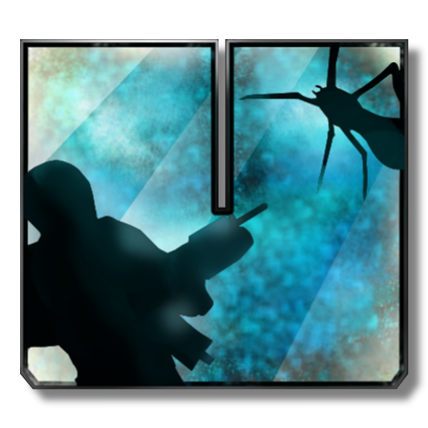 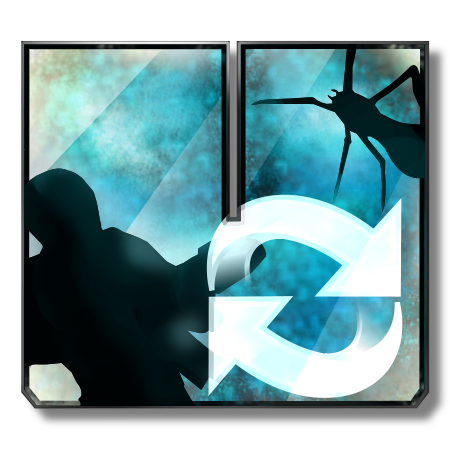

## Logos

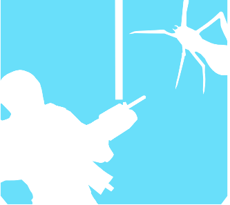 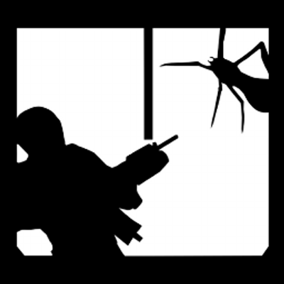

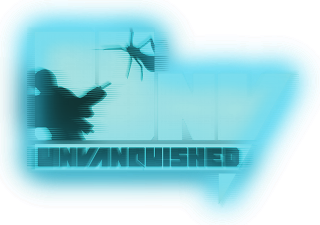 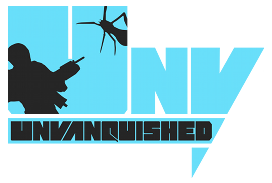

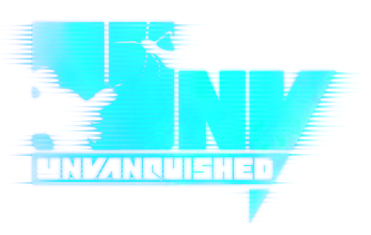
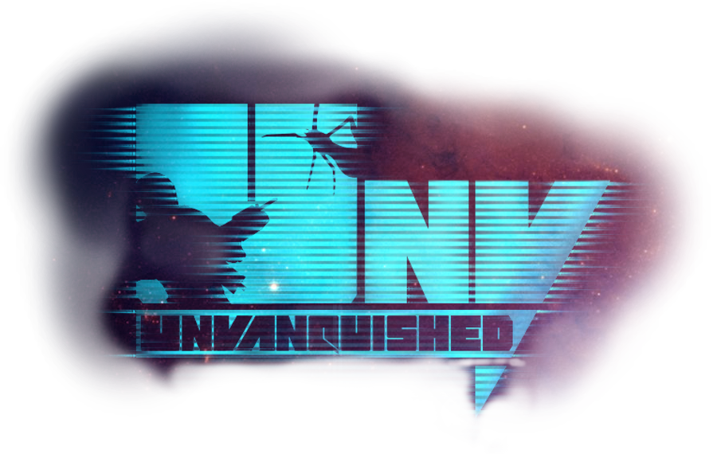
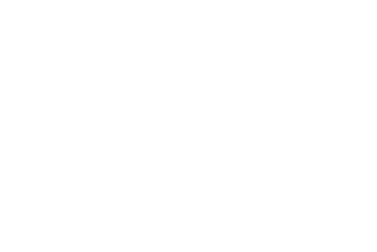

 

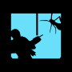

## Titles

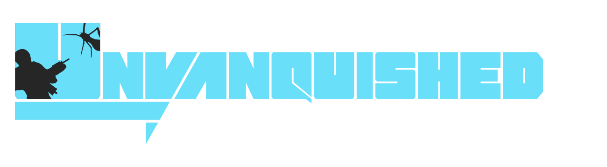

## Faces

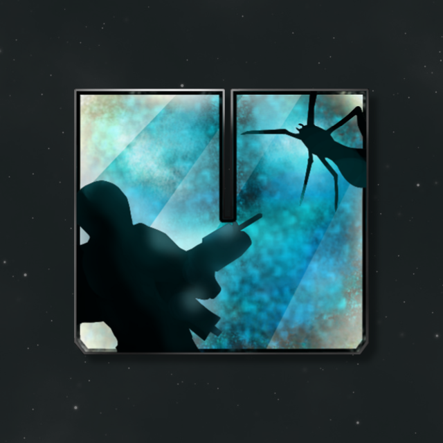

## Covers

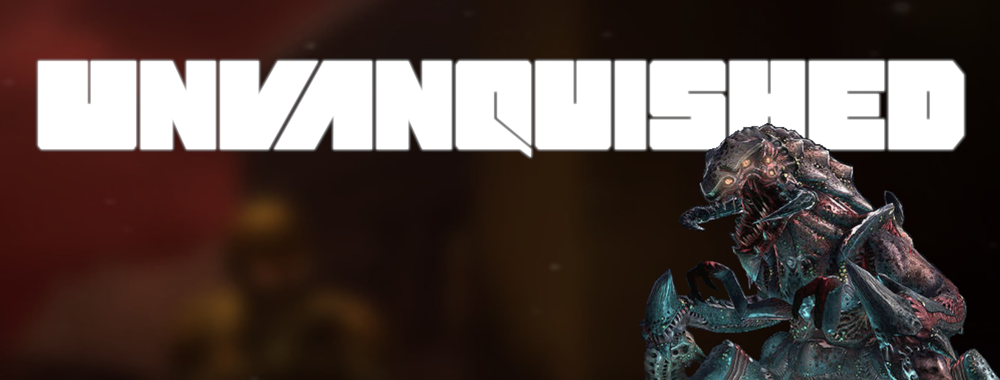

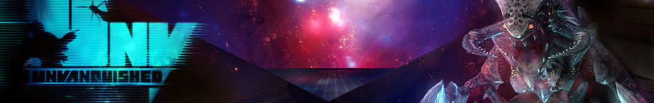

## Cards

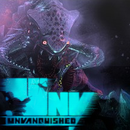 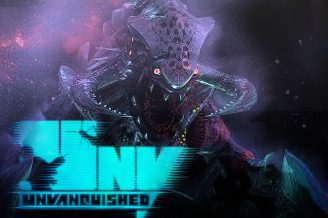

## Splashes

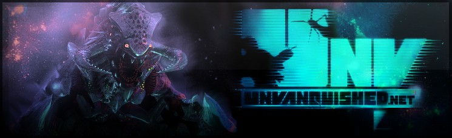

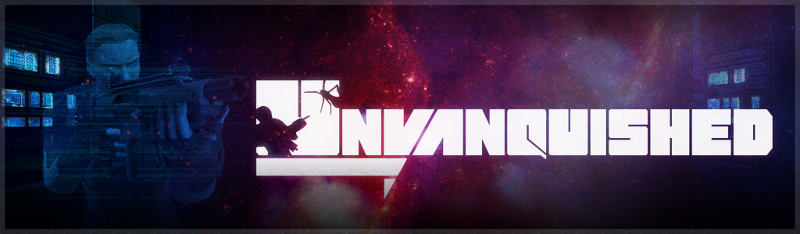

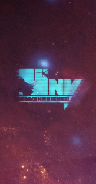